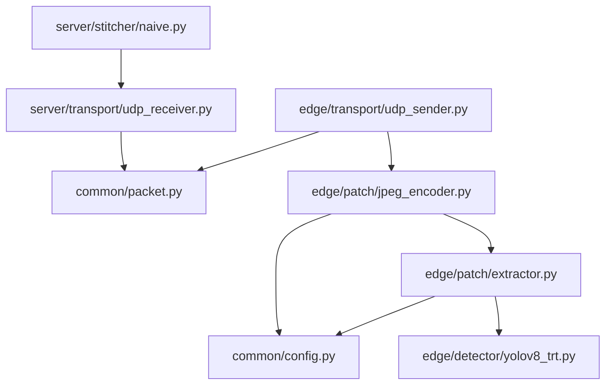

# Week 1 Code Review

**대상:** `roi-privacy-edge` Week 1 전체 코드베이스  
**기준일:** 2026-05-13 (Week 2 Day 0 expanded_bbox 수정 반영 후)  
**범위:** 읽기 전용 분석. 수정 없음, 제안만.

---

## Phase 1: 전체 파악

### 1. 디렉토리 구조 + 모듈 책임

```
roi-privacy-edge/
├── common/
│   ├── packet.py       (318 LOC) — wire format 상수·struct pack/unpack·build_packets·
│   │                              build_frame_header_packet. 프로젝트의 유일한 protocol spec.
│   └── config.py        (29 LOC) — PERSON_CLASS_ID, BBOX_MARGIN, DEFAULT_JPEG_QUALITY 등
│                                   모든 튜닝 파라미터 한 곳.
├── edge/
│   ├── detector/
│   │   └── yolov8_trt.py (233 LOC) — TRT FP16 inference. letterbox 전처리 + xywh→xyxy
│   │                                  변환 + cv2 NMS + 원본 좌표 역변환까지 포함.
│   ├── patch/
│   │   ├── extractor.py (163 LOC) — person crop + margin 확장 + frame 클립.
│   │   │                            Patch dataclass 정의.
│   │   └── jpeg_encoder.py (176 LOC) — cv2.imencode 래퍼. PatchJPEGEncoder(stateful).
│   │                                    Week 5 adaptive quality seam이 여기 박혀 있음.
│   └── transport/
│       └── udp_sender.py (137 LOC) — FRAME_HEADER 먼저, 이후 patch chunk 전송.
│                                      send_frame 단일 진입점.
├── server/
│   ├── transport/
│   │   └── udp_receiver.py (405 LOC) — 2-level reassembly(patch/frame) + TTL sweep +
│   │                                    이벤트 dispatch. 가장 비대한 파일.
│   └── stitcher/
│       └── naive.py       (159 LOC) — ReceivedPatch → grey canvas paste.
│                                       expanded_bbox 우선, 없으면 original_bbox fallback.
└── scripts/
    ├── run_edge_video.py   (180 LOC) — 메인 edge 루프: folder/mp4 → detect → encode → send
    ├── run_server_stitch.py (215 LOC) — 메인 server 루프: receive → stitch → mp4 write
    ├── test_udp_loopback.py (204 LOC) — e2e loopback (3 verify blocks): JPEG, FRAME_HEADER, bbox roundtrip
    ├── test_patch_pipeline.py (128 LOC) — Day 3-4 smoke test + quality sweep CSV
    ├── run_edge_send.py    (104 LOC) — 단발 edge 송신 (Day 5 레거시) ← HANDOFF 미기재
    ├── run_server_recv.py  (133 LOC) — 단발 server 수신 (Day 5 레거시) ← HANDOFF 미기재
    └── test_inference.py    (72 LOC) — YOLOv8TRT 단독 smoke test ← HANDOFF 미기재
```

### 2. Import Graph

```
common/config.py          (no local deps)
common/packet.py          (no local deps)
      ↑                          ↑
      |           ┌──────────────┘
      |           |
edge/detector/yolov8_trt.py  ← [외부: cv2, numpy, tensorrt, cuda.bindings]
      ↑
edge/patch/extractor.py   ← common.config
      ↑
edge/patch/jpeg_encoder.py ← common.config, edge.patch.extractor
      ↑
edge/transport/udp_sender.py ← common.packet, edge.patch.jpeg_encoder

server/transport/udp_receiver.py ← common.packet
      ↑
server/stitcher/naive.py   ← server.transport
```



**핵심 관찰:** `common/packet.py`가 edge-server 간 유일한 공유 경계. `server`쪽은 `edge`에 의존성 없음 (단방향 DAG — 좋은 설계).

### 3. LOC 분포

| 파일 | LOC | 비고 |
|---|---|---|
| `server/transport/udp_receiver.py` | **405** | 가장 비대. reassembly 상태머신 전체 |
| `common/packet.py` | 318 | 긴 docstring·assert 포함, 실질 로직은 적당 |
| `edge/detector/yolov8_trt.py` | 233 | TRT init + 전처리/후처리 일체 |
| `scripts/run_server_stitch.py` | 215 | 메인 루프 + VideoWriterLazy 포함 |
| `scripts/test_udp_loopback.py` | 204 | 3 verify block |
| `scripts/run_edge_video.py` | 180 | 메인 edge 루프 |
| `edge/patch/jpeg_encoder.py` | 176 | docstring 비중 높음 |
| `edge/patch/extractor.py` | 163 | |
| `server/stitcher/naive.py` | 159 | |
| `edge/transport/udp_sender.py` | 137 | |
| `scripts/run_server_recv.py` | 133 | 레거시 |
| `scripts/test_patch_pipeline.py` | 128 | |
| `scripts/run_edge_send.py` | 104 | 레거시, D1 버그 포함 |
| `scripts/test_inference.py` | 72 | |
| `common/config.py` | 29 | |
| **총계** | **~2,347** | |

`udp_receiver.py` 405 LOC는 이 규모에서 임계 수준. Week 2 constraint simulator 추가 시 이 파일이 더 커질 가능성이 높아 분리 검토 권장.

### 4. Public API (외부 import 심볼)

| 모듈 | 외부 import 심볼 |
|---|---|
| `common/packet.py` | `MAGIC`, `PKT_TYPE_*`, `MAX_UDP_PAYLOAD`, `MAX_PAYLOAD_BYTES`, `HEADER_SIZE`, `PATCH_META_PREFIX_SIZE`, `JPEG_CHUNK_SIZE`, `PacketHeader`, `FrameHeader`, `build_packets`, `build_frame_header_packet`, `pack/unpack_patch_meta_prefix`, `parse_frame_header_payload`, `chunk_patch_bytes` |
| `common/config.py` | `PERSON_CLASS_ID`, `BBOX_MARGIN`, `MIN_PATCH_SIZE`, `DEFAULT_JPEG_QUALITY`, `MAX_PATCH_BYTES` |
| `edge/detector/yolov8_trt.py` | `Detection`, `YOLOv8TRT` |
| `edge/patch/extractor.py` | `Patch`, `extract_patches` |
| `edge/patch/jpeg_encoder.py` | `EncodedPatch`, `PatchJPEGEncoder`, `encode_patch` |
| `edge/transport/udp_sender.py` | `UDPSender`, `SendStats` |
| `server/transport/udp_receiver.py` | `UDPReceiver`, `ReceivedPatch`, `ReceivedFrame`, `ReceiveStats` |
| `server/stitcher/naive.py` | `stitch_frame`, `StitchResult`, `DEFAULT_BG_VALUE` |

### HANDOFF.md ground truth 불일치

| # | 불일치 | 위치 | 심각도 |
|---|---|---|---|
| A | `run_edge_send.py`, `run_server_recv.py`, `test_inference.py` 3개 스크립트가 파일 구조에 없음 | HANDOFF 파일구조 섹션 | Low |
| B | `run_edge_send.py:80` — `tx.send_frame(encoded)` 호출. 실제 시그니처는 keyword-only `send_frame(*, frame_id, encoded, frame_w, frame_h)`. 실행 즉시 **TypeError** | scripts/run_edge_send.py | **High** |
| C | HANDOFF의 `edge/transport/__init__.py` exports 설명에 `SendStats` 누락 | HANDOFF | Low |
| D | HANDOFF "검증되지 않은" 항목: `stitch_frame` 첫 번째 파라미터 이름이 `rf`로 기재됐으나 실제는 `frame` | HANDOFF | Low |

---

## Phase 2: 정확성 검토

### 5. Dataclass 정합성 매트릭스

#### `Detection` — `edge/detector/yolov8_trt.py:19`

| 필드 | 타입 | 사용처 | 상태 |
|---|---|---|---|
| `x1, y1, x2, y2` | int | `extractor.py:143` `det.x1/y1/x2/y2` | ✓ |
| `confidence` | float | `extractor.py:158` | ✓ |
| `class_id` | int | `extractor.py:140` | ✓ |

**버그 — `test_patch_pipeline.py:60`:**
```python
f"bbox=({d.x1},{d.y2},{d.x2},{d.y2})"
#              ^^^^ d.y1 이어야 함 (copy-paste 오타)
```
로그만 틀리고 기능 영향 없음.

---

#### `Patch` — `edge/patch/extractor.py:36`

| 필드 | 타입 | 사용처 | 상태 |
|---|---|---|---|
| `frame_id` | int | `jpeg_encoder.py:98` | ✓ |
| `det_id` | int | `jpeg_encoder.py:99` | ✓ |
| `image` | np.ndarray | `jpeg_encoder.py:91` | ✓ |
| `original_bbox` | tuple | `jpeg_encoder.py:102` | ✓ |
| `expanded_bbox` | tuple | `jpeg_encoder.py:103` | ✓ |
| `conf` | float | `jpeg_encoder.py:105` | ✓ |
| `shape` (property) | tuple | `test_patch_pipeline.py:69` | ✓ |

`image`는 `frame`의 numpy view (copy 아님). JPEG encode 직후 소비되므로 실용 문제 없으나, docstring에 명시됨.

---

#### `EncodedPatch` — `edge/patch/jpeg_encoder.py:37`

| 필드 | 타입 | 사용처 | 상태 |
|---|---|---|---|
| `frame_id` | int | `udp_sender.py:86` | ✓ |
| `det_id` | int | `udp_sender.py:87` | ✓ |
| `data` | bytes | `udp_sender.py:91` | ✓ |
| `original_bbox` | tuple | `udp_sender.py:88` | ✓ |
| `expanded_bbox` | tuple | `udp_sender.py:89` | ✓ |
| `quality` | int | `udp_sender.py:87` | ✓ |
| `conf` | float | `udp_sender.py:90` | ✓ |
| `size_bytes` (property) | int | `run_edge_video.py:159`, `test_udp_loopback.py` | ✓ |

이상 없음.

---

#### `ReceivedPatch` — `server/transport/udp_receiver.py:73`

| 필드 | 타입 | 사용처 | 상태 |
|---|---|---|---|
| `frame_id` | int | `run_server_stitch.py`, `test_udp_loopback.py` | ✓ |
| `det_id` | int | `udp_receiver.py` 내부 | ✓ |
| `quality` | int | 정의됨 | ✓ |
| `bbox` | tuple | `naive.py:98`, `test_udp_loopback.py:177` | ✓ |
| `expanded_bbox` | tuple\|None | `naive.py:133`, `test_udp_loopback.py:188` | ✓ |
| `confidence` | float | 정의됨 | ✓ |
| `data` | bytes | `naive.py:91`, `test_udp_loopback.py` | ✓ |
| `complete` | bool | `naive.py:88`, `run_server_stitch.py:136` | ✓ |
| `chunks_received` | int | 정의됨 | ✓ |
| `chunks_expected` | int | 정의됨 | ✓ |
| **`loss_ratio`** (property) | float | **사용처 없음** | ⚠️ unused |

---

#### `ReceivedFrame` — `server/transport/udp_receiver.py:93`

| 필드 | 타입 | 사용처 | 상태 |
|---|---|---|---|
| `frame_id` | int | `run_server_stitch.py`, `test_udp_loopback.py` | ✓ |
| `frame_w` | int | `naive.py:76`, `run_server_stitch.py:207` | ✓ |
| `frame_h` | int | `naive.py:75`, `run_server_stitch.py:207` | ✓ |
| `expected_patches` | int | `run_server_stitch.py:204`, `test_udp_loopback.py:143` | ✓ |
| `patches` | List | `naive.py:87` | ✓ |
| `header_seen` | bool | `test_udp_loopback.py:155` | ✓ |
| `complete` | bool | `run_server_stitch.py:201` | ✓ |
| **`n_received`** (property) | int | **사용처 없음** | ⚠️ unused |
| `n_complete_patches` (property) | int | `run_server_stitch.py:204`, `test_udp_loopback.py:108` | ✓ |

---

### 6. Wire Format 대칭성

#### `HEADER_FORMAT = "!4sBBH I BB H H H hhhh H H"` (32 B)

**Pack** (`PacketHeader.pack`, `packet.py:144`) 16개 값:
```
MAGIC, version, pkt_type, 0,
frame_id, det_id, quality,
chunk_idx, chunk_count, payload_len,
x1, y1, x2, y2,
conf_q14, 0
```

**Unpack** (`PacketHeader.unpack`, `packet.py:173`) 16개 값:
```
magic, version, pkt_type, _r8,
frame_id, det_id, quality,
chunk_idx, chunk_count, payload_len,
x1, y1, x2, y2,
conf_q14, _r16
```

**대칭 ✓** — `assert HEADER_SIZE == 32` 런타임 검증됨.

**경계 이슈:** `bbox`가 `h`(signed int16, 최대 32767)로 저장. 프레임 폭/높이 32768px 이상 시 silent truncation. 현재 테스트 영상(768×432)에서는 무관.

**명명 오해 소지:** `conf_q14`는 Q14 관례(2^14=16384 스텝)와 달리 10000으로 스케일링. 기능 이상 없음.

---

#### `FRAME_HEADER_PAYLOAD_FORMAT = "!B H H"` (5 B)

**Build** (`build_frame_header_packet`, `packet.py:213`):
```python
struct.pack(FRAME_HEADER_PAYLOAD_FORMAT, n_patches, frame_w, frame_h)
```
**Parse** (`parse_frame_header_payload`, `packet.py:234`):
```python
struct.unpack(FRAME_HEADER_PAYLOAD_FORMAT, payload)  # → (n_patches, frame_w, frame_h)
```

**대칭 ✓** — `assert FRAME_HEADER_PAYLOAD_SIZE == 5` 런타임 검증됨.

수신 dispatch 흐름: `_ingest` → FRAME_HEADER 분기 → `_handle_frame_header` → `_maybe_emit_frame` ✓  
패치가 먼저 도착한 경우에도 FRAME_HEADER 수신 시 즉시 emit 가능한 양방향 트리거 설계.

---

#### `PATCH_META_PREFIX_FORMAT = "!HHHH"` (8 B, chunk 0 한정)

**Pack** (`pack_patch_meta_prefix`, `packet.py:245`):
```python
struct.pack(PATCH_META_PREFIX_FORMAT, ex1, ey1, ex2, ey2)
```
**Unpack** (`unpack_patch_meta_prefix`, `packet.py:257`):
```python
struct.unpack(PATCH_META_PREFIX_FORMAT, buf[:PATCH_META_PREFIX_SIZE])
```

**대칭 ✓** — `assert PATCH_META_PREFIX_SIZE == 8` 런타임 검증됨.

chunk 0 손실 시: `asm.expanded_bbox = None` 유지 → `ReceivedPatch.expanded_bbox = None` → `naive.py:_paste`가 `original_bbox`로 fallback ✓

**스테일 docstring — `naive.py:_paste` (119-127행):**
```
"this is a Day-6 simplification; Week 2 will pass expanded_bbox over the wire too"
```
Week 2 Day 0에 이미 해결됐으나 docstring이 구버전 설명을 유지 중. 코드 본체(131-141행)는 올바르게 동작함.

---

### 7. Error Handling 위험 지점 인벤토리

#### 네트워크 IO

| 위치 | 호출 | 실패 시나리오 | 현재 처리 | 부족한 부분 |
|---|---|---|---|---|
| `udp_sender.py:63` | `socket.sendto` | ENOBUFS, ENETUNREACH | `except OSError` → `send_errors += 1` ✓ | — |
| `udp_sender.py:50` | `setsockopt SO_SNDBUF` | 권한 부족 | `except OSError: pass` ✓ | — |
| `udp_receiver.py:166` | `socket.recvfrom` | BlockingIOError | `except BlockingIOError` ✓ | **다른 `OSError` subclass 미처리** (소켓 닫힘 등 → crash) |
| `udp_receiver.py:146` | `setsockopt SO_RCVBUF` | 권한 부족 | `except OSError: pass` ✓ | — |

#### 파일 IO

| 위치 | 호출 | 실패 시나리오 | 현재 처리 | 부족한 부분 |
|---|---|---|---|---|
| `run_edge_video.py:56` | `cv2.imread` | 파일 없음 | `if img is None: warn; continue` ✓ | — |
| `run_edge_video.py:60` | `VideoCapture.isOpened` | 파일 없음·codec | `raise SystemExit` ✓ | — |
| `run_server_stitch.py:55` | `cv2.VideoWriter` | codec 없음·경로 | `raise RuntimeError` ✓ | — |
| **`run_server_stitch.py:211`** | **`cv2.imwrite`** | **디스크 풀·경로** | **반환값 무시** | **`--png-dir` 사용 시 저장 실패 감지 안 됨** |

#### cv2 연산

| 위치 | 호출 | 실패 시나리오 | 현재 처리 | 부족한 부분 |
|---|---|---|---|---|
| `jpeg_encoder.py:91` | `cv2.imencode` | 인코딩 실패 | `if not ok: raise ValueError` ✓ | — |
| `naive.py:114` | `cv2.imdecode` | 손상된 JPEG | `return None` → caller skip ✓ | — |
| `naive.py:154` | `cv2.resize` | 이상 입력 | uncaught | patch_img 유효 시 실용 위험 낮음 |

#### TensorRT / CUDA (`yolov8_trt.py`)

```python
assert err == cudart.cudaError_t.cudaSuccess  # 6개
assert ok, "TensorRT execute_async_v3 failed"  # 1개
```

`python -O` 플래그 시 7개 assert 전부 비활성화 → CUDA OOM 등 조용히 통과. `raise RuntimeError(...)` 형태 교체 권장.

---

### 8. 신규 발견 부채 목록

(기제외: SIGINT 처리, expanded_bbox wire 누락, quality sweep CSV plot, MOT17)

| ID | 내용 | 위치 | Severity |
|---|---|---|---|
| **D1** | `tx.send_frame(encoded)` — positional 인수 전달, 실제 시그니처 `send_frame(*, frame_id, encoded, frame_w, frame_h)`. **실행 즉시 TypeError** | `run_edge_send.py:80` | **High** |
| D2 | `f"bbox=({d.x1},{d.y2},{d.x2},{d.y2})"` — `d.y1` 자리에 `d.y2` 중복 (copy-paste 오타, 로그만 영향) | `test_patch_pipeline.py:60` | Medium |
| D3 | `_paste` docstring "Week 2 will pass expanded_bbox" — Week 2 Day 0에 이미 해결됐으나 구버전 설명 잔존 | `server/stitcher/naive.py:119` | Medium |
| D4 | `cv2.imwrite()` 반환값 미확인 — `--png-dir` 사용 시 디스크 풀·경로 오류가 조용히 실패 | `run_server_stitch.py:211` | Medium |
| D5 | `ReceivedPatch.loss_ratio` property — 정의됨, 코드베이스 전체에서 사용처 없음 | `udp_receiver.py:86` | Low |
| D6 | `ReceivedFrame.n_received` property — 정의됨, 코드베이스 전체에서 사용처 없음 | `udp_receiver.py:109` | Low |
| D7 | `wire_before = tx.stats.bytes_sent` 할당 후 미사용 (dead code) | `run_edge_send.py:91` | Low |
| D8 | CUDA/TRT 오류를 `assert`로 처리 — `python -O` 시 전부 비활성화 (7개) | `yolov8_trt.py:78,80,83,125,129,136,139` | Low |
| D9 | `conf_q14` 변수명 — Q14 관례(16384 스텝)와 달리 10000 스케일링, 오해 소지 | `packet.py:143` | Low |
| D10 | `bbox` header 필드가 `h`(int16) — 프레임 폭 32768px 이상 시 silent truncation | `packet.py:HEADER_FORMAT` | Low |
| D11 | `poll()` — `BlockingIOError`만 catch, 소켓 오류 등 다른 `OSError` 미처리 | `udp_receiver.py:167` | Low |
| D12 | `run_edge_send.py`, `run_server_recv.py` — HANDOFF 미기재 레거시, D1 버그 포함으로 오해 소지 | `scripts/` | Low |

---

## Phase 3: 코드 품질

### 9. 학부 ICT 평가 기준 — 보고서 적합성

#### 강점 3개

**강점 1 — `common/packet.py`가 설계 문서 수준**

패킷 모듈의 docstring은 "무엇"이 아닌 "왜"를 설명함. FRAME_HEADER가 필요한 이유, chunk 0 prefix 방식을 선택한 이유 (header에 8B 빈 슬롯 없음, chunk 0 손실 = JPEG SOI 손실이라 redundancy 무의미), int16/uint16 혼용 이유까지 명시. `assert HEADER_SIZE == 32`, `assert JPEG_CHUNK_SIZE == 1360` 같은 런타임 상수 검증도 포함. 평가자가 이 파일 하나만 읽어도 "설계 트레이드오프를 의식한 구현"임을 알 수 있음.

→ **보고서 Section 3 (System Design)에 wire format 다이어그램과 함께 핵심 docstring 발췌 첨부 권장.**

**강점 2 — 계층 간 의존성이 단방향 DAG**

`server/`가 `edge/`를 import하지 않음. `common/packet.py`만 공유. 이 구조 덕분에 TensorRT/CUDA 의존성이 server 쪽에 전혀 없고, edge와 server가 독립 배포 가능. 학부 수준에서 보기 드문 명시적 경계 설계.

→ **보고서에 import graph 다이어그램 한 장으로 아키텍처 이해도 어필 가능.**

**강점 3 — `test_udp_loopback.py`가 3-block 정량적 검증**

단순 "동작함"이 아니라 세 가지를 독립 검증:
- Block 1: JPEG 바이트 byte-for-byte identity
- Block 2: FRAME_HEADER plumbing (expected_patches, frame_w×h, header_seen, complete)
- Block 3: bbox 쌍 round-trip (original in header, expanded in chunk 0 prefix)

`all_ok` 플래그로 CI스러운 PASS/FAIL 출력. 100 frames e2e (frames_complete=100, bad_pay=0) 실측 결과 보유.

→ **보고서 Appendix에 loopback 실행 출력 + e2e 실측 결과 스크린샷 첨부 권장.**

#### 약점 3개

**약점 1 — 평가 환경이 단일 영상 + 무손실 조건에 한정**

MOT17 실패로 `person-bicycle-car-detection.mp4` 하나만 사용. 같은 서브넷 Wi-Fi 무손실 환경. 보고서에 "한계 및 향후 과제" 섹션이 없으면 평가자의 "최악 조건에서도 작동하는가?" 질문에 반증 불가.

→ **보고서에 Limitations 섹션을 명시하고 Week 2 constraint simulator 결과로 채울 자리를 미리 확보.**

**약점 2 — 정량적 화질 메트릭 없음**

quality sweep CSV는 생성되지만 plot 없음 (부채 D3). PSNR/SSIM 미구현. "RoI만 보내도 화질이 충분하다"를 숫자 없이 주장하면 설득력이 약함. `patch_sizes.csv` 데이터는 있으니 matplotlib으로 bytes-vs-quality 커브 하나면 Figure 추가 가능.

→ **`test_patch_pipeline.py`의 quality sweep 결과로 Figure 하나를 Week 3 전에 생성 권장. 이건 30분 작업.**

**약점 3 — 레거시 코드가 보고서 첨부 코드를 오염시킬 수 있음**

`run_edge_send.py`의 D1 TypeError, `_paste` docstring의 구버전 설명(D3). 평가자에게 코드를 보여줄 때 이 파일이 섞이면 "이 코드가 실제로 동작하는가?" 의문을 줄 수 있음. 특히 D1은 실행해보면 즉시 드러남.

→ **보고서 코드 첨부 전에 D1·D2·D3 수정, 레거시 스크립트는 `scripts/legacy/`로 이동하거나 deprecated 표시 권장.**

#### 보고서에 강조할 부분

| 항목 | 이유 |
|---|---|
| `packet.py` 전체 docstring | 설계 의도 + 트레이드오프 명시, 코드 = 문서 |
| `_maybe_emit_frame` 양방향 트리거 (`udp_receiver.py:317`) | 헤더 먼저·패치 먼저 모두 처리하는 event-driven reassembly 설계 |
| `PatchJPEGEncoder.set_quality()` (`jpeg_encoder.py:137`) | Week 5 adaptive quality의 insertion point를 Week 1부터 명시적으로 설계 |
| loopback 3-block verify 실행 결과 | CI스러운 정량 검증 구조 |

---

### 10. Week 2 인터페이스 — 끼어들 자리 분석

#### Day 1-2: Constraint Simulator (drop / delay / noise)

**현재 insertion point:**

```python
# udp_receiver.py:166-173 (poll 내부)
buf, _addr = self._sock.recvfrom(MAX_UDP_PAYLOAD)
# ← 여기서 buf를 drop/변형하면 simulator 완성
for event in self._ingest(buf):
    yield event
```

`UDPReceiver`가 소켓을 직접 소유하므로 현재 구조에서 외부 intercept 불가. 선택지:

- **Option A (비침습):** Loopback proxy socket — simulator가 별도 포트에서 패킷을 받아 변형 후 실제 receiver로 중계. `UDPReceiver` 무수정.
- **Option B (권장):** `UDPReceiver.__init__`에 `packet_filter` callable 파라미터 추가:
  ```python
  # 제안 — UDPReceiver 1-2 LOC 수정
  def __init__(self, ..., packet_filter=None):
      self._packet_filter = packet_filter  # Callable[[bytes], bytes | None]
  ```
  `poll()` 내부에서:
  ```python
  buf, _addr = self._sock.recvfrom(MAX_UDP_PAYLOAD)
  if self._packet_filter:
      buf = self._packet_filter(buf)
      if buf is None:
          continue  # drop
  ```

**결론:** 삽입 지점 명확, 현재 무수정 삽입은 불가. Option B로 1-2 LOC 수정이 가장 clean.

---

#### Day 3-4: Recovery Layer (IoU tracker + zero-order hold + interpolation)

**현재 파이프라인:**
```
ReceivedFrame ──→ stitch_frame() ──→ np.ndarray
```

**Recovery layer 삽입 위치:**
```
ReceivedFrame ──→ recovery.enhance(rf) ──→ ReceivedFrame (보강) ──→ stitch_frame()
```

`ReceivedFrame` 인터페이스 확장 가능성:

- `patches: List[ReceivedPatch]` — mutable list, missing patch 추가 및 incomplete patch `data` 교체 가능
- `expected_patches: int` — 목표 개수 명시됨, tracker가 완성도 판단 가능
- `frame_w, frame_h` — canvas 크기 알 수 있음

**호환성: 양호.** `run_server_stitch.py`의 `_handle_frame()` 함수가 이미 분리되어 있어 수정 범위 1함수로 격리:

```python
def _handle_frame(rf, writer, png_dir, draw_bbox):
    rf = recovery.enhance(rf)          # 이 1줄만 추가
    res = stitch_frame(rf, draw_bbox=draw_bbox)
    ...
```

**주의:** `ReceivedPatch.expanded_bbox`가 chunk 0 손실 시 `None`. tracker의 bbox 참조 시 `p.expanded_bbox or p.bbox` fallback 필요. 이 패턴은 `naive.py:_paste`에 이미 있어 참조 가능.

**결론: `ReceivedFrame` 인터페이스는 recovery layer 삽입에 잘 준비되어 있음.**

---

#### Day 5: Adaptive JPEG Quality Controller

**Edge seam 상태 — 완비:**
```python
# jpeg_encoder.py:137
def set_quality(self, quality: int) -> None:
    """Adaptive controller calls this."""
    self._quality = int(quality)
```
`encoder.set_quality(new_q)` 한 줄로 다음 프레임부터 적용.

**갭: server → edge feedback transport 없음.**
- `UDPSender`는 send-only socket — recv 불가
- feedback을 받으려면 edge에 별도 recv socket 신설 필요

**결론:** quality controller seam(encoder 쪽)은 ready. feedback transport가 Day 5 작업의 절반.

---

#### Day 6: Closed-loop Feedback (PKT_TYPE_FEEDBACK)

**현재 reservation 점검:**

| 항목 | 상태 |
|---|---|
| `PKT_TYPE_FEEDBACK = 2` 상수 (`packet.py:76`) | ✓ 있음 |
| `PKT_TYPE_HEARTBEAT = 1` 상수 (`packet.py:74`) | ✓ 있음 |
| FEEDBACK payload struct format | ✗ 없음 |
| edge 쪽 feedback recv socket | ✗ 없음 |
| server 쪽 feedback send 경로 | ✗ 없음 |
| `udp_receiver.py:_ingest` FEEDBACK dispatch | 현재 `pkt_type != PATCH_CHUNK`는 조용히 drop (server→edge 방향이라 server가 수신 불요, 정상) |

**결론:** 상수 이름만 예약된 상태. `FEEDBACK_PAYLOAD_FORMAT` 상수를 `packet.py`에 미리 추가해두면 Day 6 진입이 빨라짐.

---

#### Week 2 인터페이스 총평

| Day | 준비도 | 필요한 최소 수정 |
|---|---|---|
| Day 1-2 constraint simulator | 삽입 지점 명확, 비침습 불가 | `UDPReceiver.__init__`에 `packet_filter` 파라미터 1개 |
| Day 3-4 recovery layer | **잘 준비됨** | `_handle_frame`에 `recovery.enhance(rf)` 1줄 |
| Day 5 adaptive quality | encoder seam 준비됨, transport 갭 | edge에 feedback recv socket 신설 |
| Day 6 closed-loop | 상수만 예약 | `FEEDBACK_PAYLOAD_FORMAT` 추가 + edge recv dispatch |

가장 ready한 인터페이스: **Day 3-4 recovery** (`ReceivedFrame` → recovery → `stitch_frame`)  
가장 공사량이 큰 인터페이스: **Day 5-6 feedback path** (edge recv 없음, server send 없음)

---

## 종합 Action Items

### 즉시 (Week 2 시작 전)

| ID | 작업 | 파일 |
|---|---|---|
| D1 | `send_frame(encoded)` → `send_frame(frame_id=fid, encoded=encoded, frame_w=w, frame_h=h)` 수정 | `scripts/run_edge_send.py:80` |
| D2 | `d.y2` → `d.y1` 오타 수정 | `scripts/test_patch_pipeline.py:60` |
| D3 | `_paste` docstring "Week 2 will pass expanded_bbox..." 구버전 설명 제거 | `server/stitcher/naive.py:119-127` |

### 보고서 제출 전 (May 29 전)

- quality sweep plot 생성 (`patch_sizes.csv` → matplotlib Figure)
- 보고서에 Limitations 섹션 추가
- 레거시 스크립트 (`run_edge_send.py`, `run_server_recv.py`) `scripts/legacy/` 이동 또는 deprecated 표시

### Week 2 설계 시

- `UDPReceiver.__init__`에 `packet_filter` 파라미터 추가 (Day 1-2 constraint simulator 준비)
- `packet.py`에 `FEEDBACK_PAYLOAD_FORMAT` 상수 사전 정의 (Day 6 준비)
